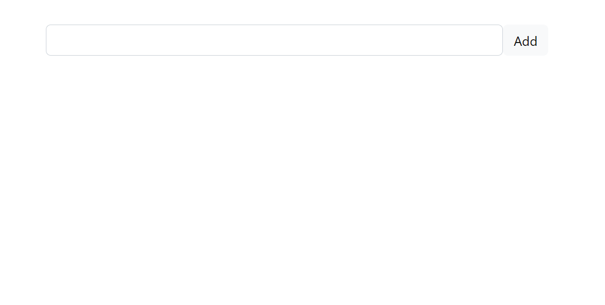
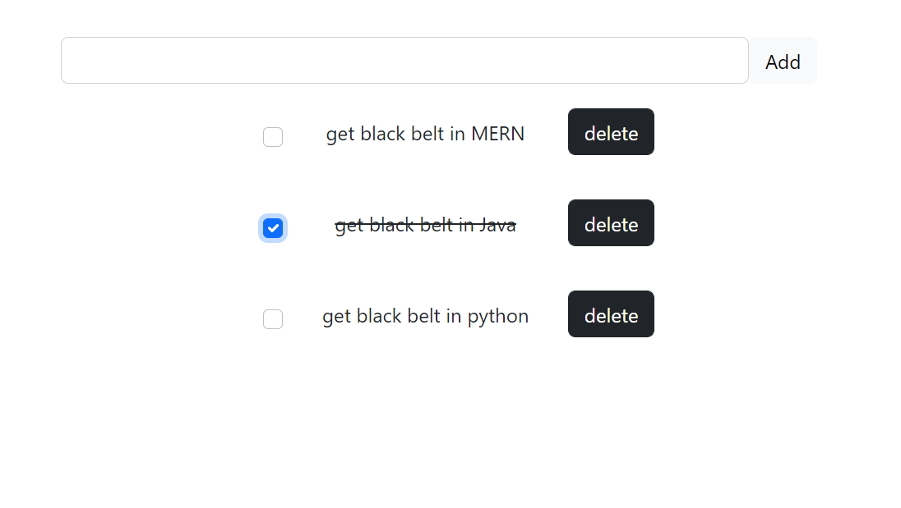
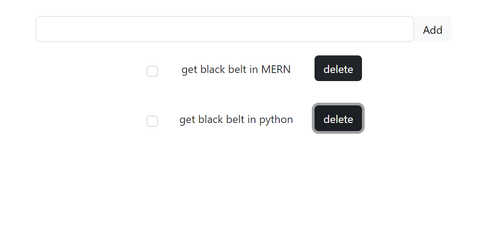

# TODO-list
a small React application to store and modify a list of tasks. a user can add task, checked it when complete and delete it if user dosn't need it. In addition, the list won't disapper when refreshing page. In the following we provide images of the app to illustrate its functionality 

### Start the app 

### Three tasks are added, one task was completed 

### After deleting the second task

